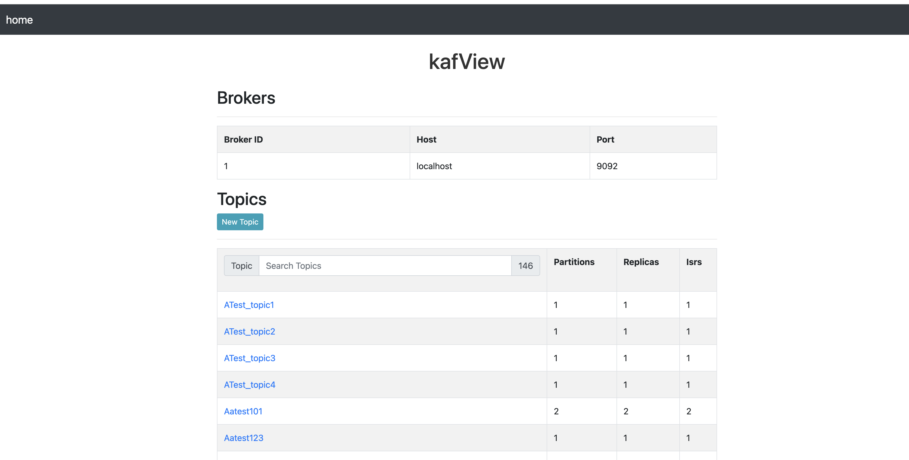
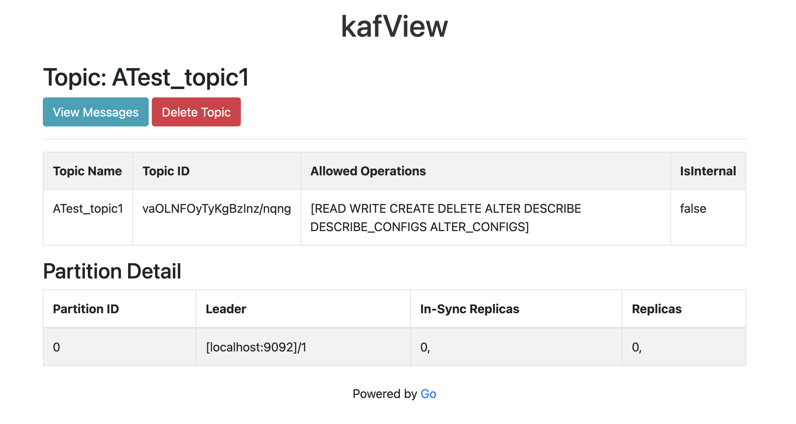

## kafView:
kafView - A UI for kafka server.

home


topic details


## kafCtl:
A CMD line tool for kafka server to view and manipulate kafka server operation through command line.

#### UseCase: 
To extract all messages in bulk from a PROD/QA env to analyse any message.
        Especially for DLQ messages this could be more helpful.

#### Usage:

#### with SSL:
```bash
./kafctl -b <broker> -t <topic> -g <consumer-group> -o <consumer_out.json> -s -f <ssl-config.json>
./kafctl -b kafka-service:9093 -t topic_internal -g xconsumer-id-5 -o consumer_out.json -s -f config.json 
```

#### without SSL:
```bash
./kafctl -b <broker> -t <topic> -g <consumer-group> -o <consumer_out.json>
./kafctl -b localhost:9092 -t purchases -g xconsumer-id-5 -o consumer_out.json
```
```bash
config.json:
{
    "securityProtocol": "SSL",
    "sslCaLocation": "./ssl/cacerts.pem",
    "sslCertLocation": "./ssl/public_key.pem",
    "sslKeyLocation": "./ssl/private_key.pem",
    "sslKeyPassword": "mykeypassword"
  }
  ```
